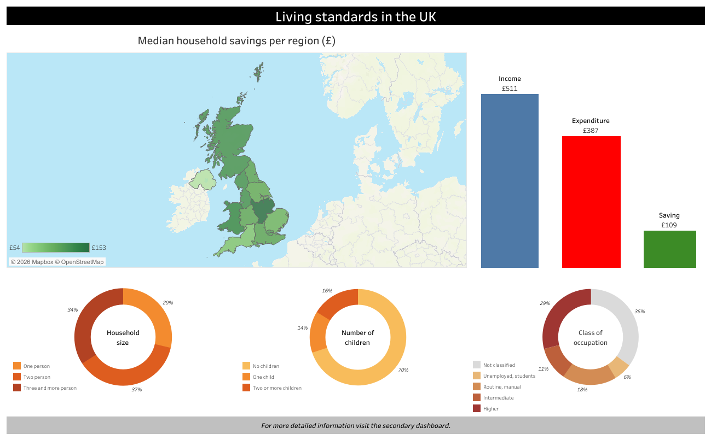
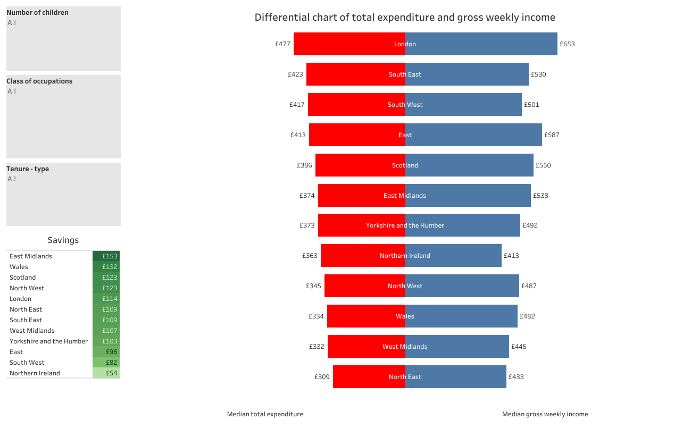

# UK Living Costs & Savings — Interactive BI Dashboards (Tableau)

Two-level Tableau dashboard suite (overview + drill-down) exploring **regional differences in household income, expenditure and derived savings** in the UK.
Built with an emphasis on **robust KPI choices** and **stakeholder-friendly navigation**.

## Preview

## Live dashboards
- **Primary (Overview):**
  https://public.tableau.com/app/profile/karol.jur.k/viz/LCF_dashboard/Dashboard1
- **Secondary (Drill-down):**
  https://public.tableau.com/app/profile/karol.jur.k/viz/LCF_dashboard/Dashboard4
- **GitHub Pages (embed):**
  https://karol-jurik.github.io/tableau-lcf-dashboards/

## What this demonstrates
- **Dashboarding & BI thinking:** clear layout, interaction design, and drill-down flow (overview → detail).
- **Data awareness:** handling distribution issues (top-coding / outliers) via robust summarization.
- **Communication:** a data-driven story for a concrete user decision ("move or stay" when planning a family).

## Design choices 
- **Two-level flow:** start with regional overview, then drill down into segmentation/filters.
- **Median-based KPIs:** chosen because key variables are not normally distributed and are top-coded, so the median is more stable than the mean.
- **Interactive filtering:** region selection drives the rest of the views.

## Data 
Based on the UK Living Costs and Food Survey teaching dataset (LCF): ~5.2k households and 14 variables including income, total expenditure and socio-demographics.

## Storytelling 
A short narrative was built around questions such as **cost of having a child by region** and how income/expenditure trade-offs affect relocation decisions.

## Notes
Portfolio / educational project. Tableau skills and the underlying principles (KPI consistency, robustness, interaction design) transfer well to **Power BI**.

## Documentation 
- Dashboard write-up: docs/dashboard_all_tasks.pdf
- Storytelling deck: docs/LCF_Storytelling_presentation.pdf

